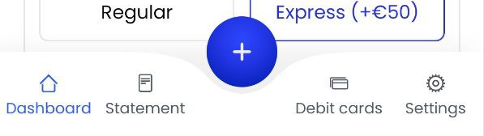

<h1 align="center">Hi there, I'm <a href="www.linkedin.com/in/konstantyn-zakharchenko" target="_blank">Konstantyn</a> 
</h1>
<h3 align="center">Welcome to Test task for Wittix</h3>

# Here are some notes.
### Tasks are logged in <a href="https://trello.com/b/meNfxVgV/testtask">Trello</a>

### Design used is in <a href="https://www.figma.com/file/SjsOeb5VUdgcxTREVOdrUo/Mivhan?type=design&node-id=0-121&mode=design&t=Bgv3QOEqq1ClANEh-0">Figma</a>

#### Few words about Architecture

I decided to go with basic  Clean Architecture + MVVM + Jetpack Compose + Android Architecture Components

MainActivity is used just for Navigation between components and showing Bottom bar with Floating Action Button. 

Every screen have its own Routing file, where we are setting up ViewModel and pass State further to the Composables 
Also here we are storing Routing information, receiving data from other screens etc. 

Composable files are divided by logic blocks. Some of them are reusable, so they are designed that way. Others belong only for specific screens, so they are depending on screen specific State.  
I've decided to keep it that way so the code would be a bit cleaner and readable. 

Screen State consists mainly from mutableStateOf(Smth), so that composable can use their data by remember {state.smth}. 
This way we can update specific Composables on the screen without triggering full screen reload. 
If we still need to reload whole screen, we still can update whole screen with _stateFlow.update{ it.copy()} 

I've tried to make UI as pixel perfect as possible, especially in fonts and sizes. 
Also, there are some fancy animations added in default Android way and my beloved Lottie, and custom ripple effects  for example in Floating action button. 
By the way, check out my solution for bottom nav bar, cutout. It was quite a challange to create it.  
I had to use Bezie cubic curve with subtracting of the path from the bounding rectangle to create this shape, so it can be resized for different screens properly. 

  

Pretty cool right? 

Also, Floating action button in design has gradient, so I needed to create my own version of FAB instead of standard Android one. 

One last thing. I decided to add a bit of domain layer, so the ViewModel looks a bit more production ready. 

## In case you are still not convinced.
### Just try out some instrumented tests in Android Test folder.

